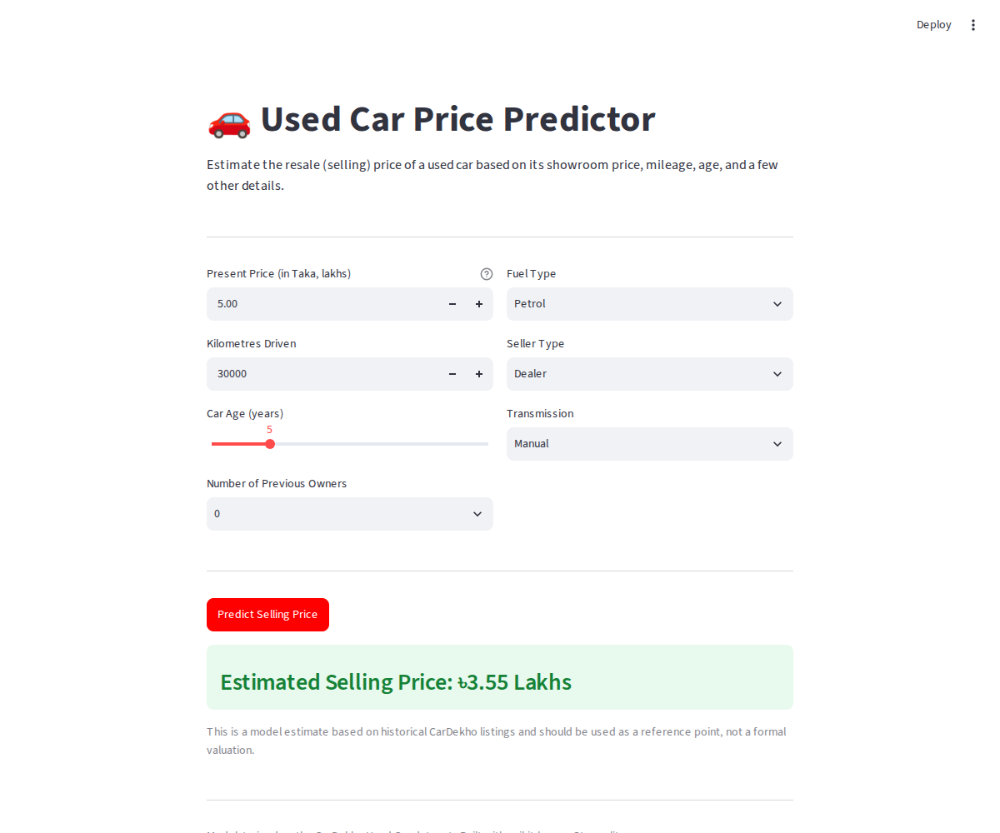

# Used Car Price Prediction

## Overview
An end-to-end machine learning project that predicts the resale (selling) price of a used car
from its attributes — showroom price, mileage, age, fuel type, seller type, transmission, and
ownership history. The pipeline covers exploratory data analysis, feature engineering, training
and comparing five regression models, and deploying the best one as an interactive Streamlit web
app.

## Dataset
- **Source:** Kaggle — [Vehicle Dataset from CarDekho](https://www.kaggle.com/datasets/nehalbirla/vehicle-dataset-from-cardekho) (`nehalbirla/vehicle-dataset-from-cardekho`)
- **Features used:** `Present_Price`, `Kms_Driven`, `Fuel_Type`, `Seller_Type`, `Transmission`, `Owner`, `Car_Age` (engineered from `Year`)
- **Target:** `Selling_Price`
- **Total samples:** 301 raw rows (299 after removing 2 exact duplicate rows)

## Key EDA Findings
- `Present_Price` is by far the strongest predictor of `Selling_Price` (Pearson r ≈ **0.88**).
- `Selling_Price` is heavily **right-skewed** (skew ≈ 2.49) — most cars sell under 10 Lakhs, with
  a long tail of premium vehicles (Fortuner, Land Cruiser, Corolla Altis).
- **Diesel** and **Automatic** cars have a noticeably higher median selling price than
  Petrol/Manual cars.
- `Car_Age` correlates negatively with price (r ≈ -0.24), but the relationship is noisy because
  `Present_Price` varies enormously across car segments — an old Fortuner still outsells a new
  hatchback.
- `Kms_Driven` contains an extreme outlier (one listing shows 500,000 km) that was capped at the
  99th percentile before training.

## Model Comparison

| Model | Train R² | Test R² | Test RMSE |
|-------------------|----------|---------|-----------|
| **XGBoost (tuned: n=300, depth=4, lr=0.05)** | **0.9986** | **0.8483** | **1.9773** |
| XGBoost (default) | 1.0000 | 0.7921 | 2.3147 |
| Linear Regression | 0.9056 | 0.7769 | 2.3981 |
| Ridge Regression (alpha=0.1) | 0.9056 | 0.7768 | 2.3985 |
| LightGBM (tuned: n=300, depth=5, lr=0.05) | 0.9114 | 0.6930 | 2.8129 |
| LightGBM (default) | 0.9027 | 0.6836 | 2.8558 |
| Random Forest (n_estimators=100) | 0.9825 | 0.4845 | 3.6452 |

*(80/20 train-test split, `random_state=42`. With only ~299 rows, results are noticeably
sensitive to the exact split — Random Forest in particular drew a harder test fold in this run.)*

## Final Model
**Model:** XGBoost Regressor (tuned: `n_estimators=300`, `max_depth=4`, `learning_rate=0.05`)
**Test R²:** 0.8483
**Test RMSE:** 1.98 Lakhs
**Why this model:** It achieved the highest Test R² of all five candidates and handles the mixed
numeric/categorical features and non-linear interactions (e.g. `Present_Price` × `Car_Age`) well
without heavy preprocessing. There is a moderate overfitting gap (Train R² 0.999 vs Test R² 0.848)
that's worth noting — likely a consequence of the small sample size — but it still generalizes
better than every other model tested.

## Web Application
Deployed using Streamlit.
[Live URL — add after deploying to Streamlit Cloud]

### Screenshots


## Installation
```
git clone [your-repo-url]
cd used-car-price-prediction
pip install -r requirements.txt
```

## Usage
```
streamlit run app.py
```

## Technologies Used
- Python
- Pandas, NumPy, Matplotlib, Seaborn
- Scikit-learn, XGBoost, LightGBM
- Streamlit
